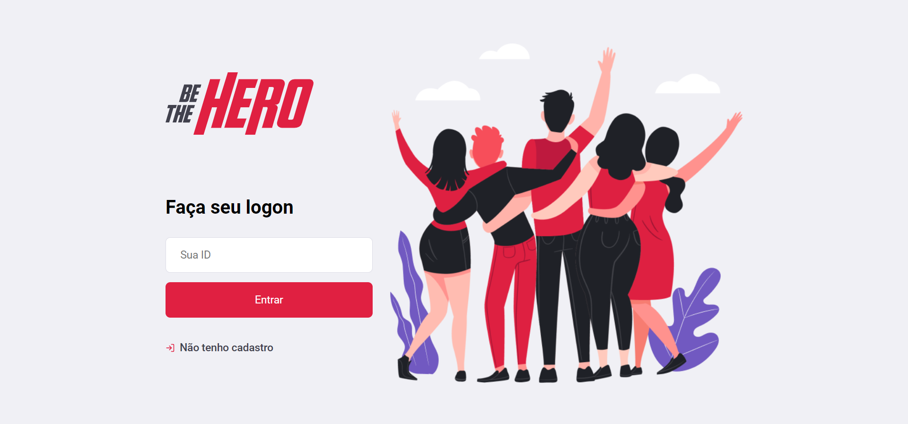

# Be-The-Hero
Projeto feito na semana omnistack, organizado pela Rocketseat

<p align="center">
  
</p>

<h1 align="center">
    
</h1>

## Sobre 📖
Aplicação para conectar ONGs e outras instituições a pessoas que tem disponibilidade para ajudar.

## 🧪 Tecnologias
Esse projeto foi desenvolvido usando as seguintes tecnologia:

- [React](https://reactjs.org/).
- [ReactNative](https://reactnative.dev/).
- [Expo](https://expo.dev/).
- [NodeJ](https://nodejs.org/en/).

## 🔃Clonar o projeto

```bash
$ git clone https://github.com/EduardoBrugnago/Be-The-Hero
```
Para concluir em cada pasta (Backend, Frontend e Mobile):
```bash
# Instalar as dependencias.
$ yarn install

# Iniciar o projeto.
$ yarn start
```

<p align="center">Developed by 🚀 Rocketseat. Reproduced by: <a href="https://github.com/EduardoBrugnago/">Eduardo Brugnago.</p>
